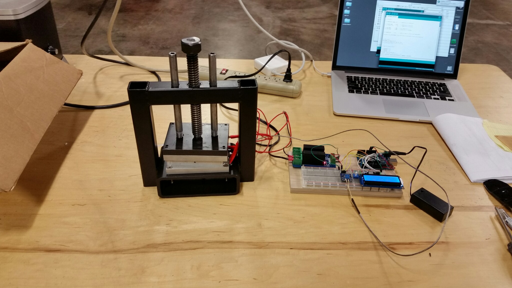
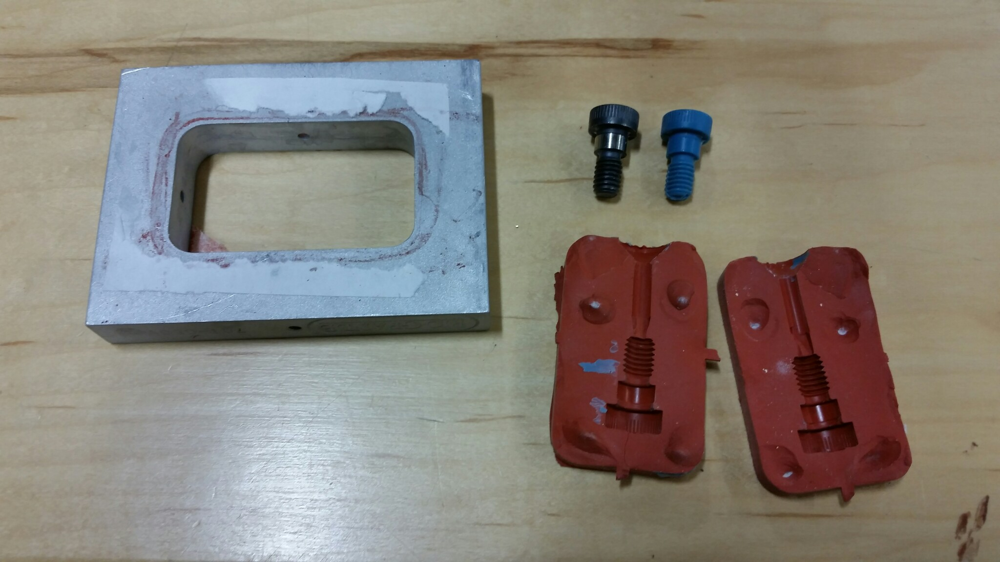

# Arduino Tempature Controller

This is initial code used to have a Arduino Control a cartridge heater and maintain a set temperature. The initial focus is to have the code controll 100W cartridge heaters that are used for a Vulcanizer Press, which is used to make rubber molds for Wax Injection.

## Fabricated Press Prototype and Arduino Controller

## Example of mold made with Protoype

